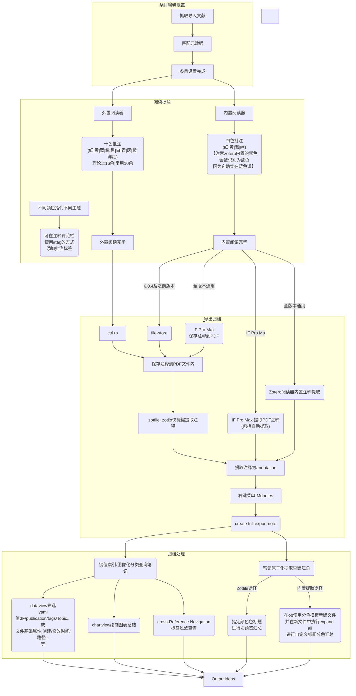

```mermaid
graph TB
subgraph 条目编辑设置
抓取导入文献-->匹配元数据
匹配元数据-->条目设置完成

end

&nbsp;
subgraph 阅读批注
条目设置完成-->外置阅读器
条目设置完成-->内置阅读器
外置阅读器-->1("十色批注<br>(红|黄|蓝|绿|黑|白|青|灰|橙|洋红)<br>理论上16色|常用10色")---->外置阅读完毕
不同颜色指代不同主题-->0("可在注释评论栏<br>使用#tag的方式<br>添加批注标签")
内置阅读器-->2("四色批注<br>(红|黄|蓝|绿)<br>【注意zotero内置的紫色<br>会被识别为蓝色<br>因为它确实在蓝色谱】")---->内置阅读完毕
end

subgraph 导出归档
外置阅读完毕-->ctrl+s-->保存注释到PDF文件内
内置阅读完毕--6.0.4及之前版本---->3(file-store)-->保存注释到PDF文件内
内置阅读完毕--全版本通用-->4(IF Pro Max<br>保存注释到PDF)-->保存注释到PDF文件内 
保存注释到PDF文件内--->zotfile+zotilo快捷键提取注释--->提取注释为annotation
内置阅读完毕--IF Pro Max-->5("IF Pro Max 提取PDF注释<br>(包括自动提取)")--->提取注释为annotation
内置阅读完毕--全版本通用---->10(Zotero阅读器内置注释提取)
提取注释为annotation-->右键菜单-Mdnotes-->6(create full export note)
10---->提取注释为annotation
end

subgraph 归档处理
6-->12(键值索引/图像化分类查询笔记)
6-->13(笔记原子化提取重建汇总)
12-->7("dataview筛选<br>yaml值:IF/publication/tags/Topic...<br>或<br>文件基础属性:创建/修改时间/路径...<br>等")
12-->14(chartview绘制图表总结)
12-->9(cross-Reference Nevigation<br>标签过滤查询)
13--Zotfile途径-->8(指定颜色色标题<br>进行块预览汇总)
13--内置提取途径-->11(在ob使用分色模板新建文件<br>并在新文件中执行expand all<br>进行自定义标题分色汇总)
end

7-->OutputIdeas
8-->OutputIdeas
9-->OutputIdeas
11-->OutputIdeas
14-->OutputIdeas


```